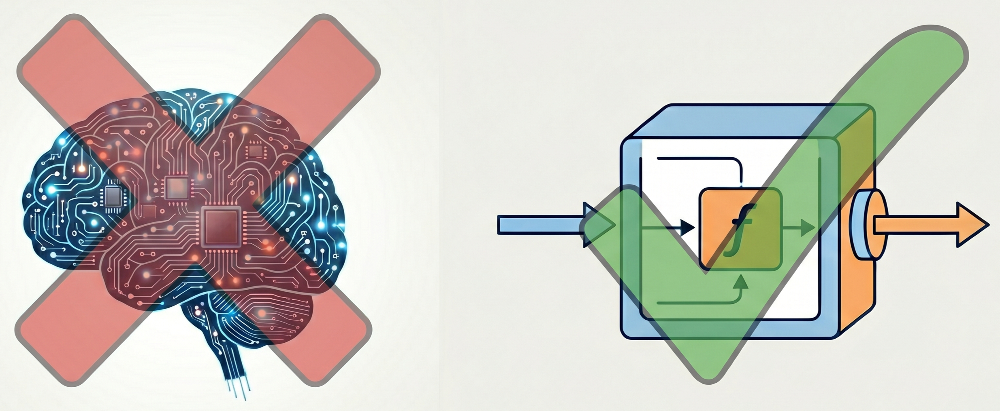

#### **Türkçe Oku:** [Büyük dil modellerini “zeka sahibi” sanıyoruz](../Türkçe-(Turkish)/LLMleri-“zeka-sahibi”-sanıyoruz.md)

# We believe that Large Language Models are "intelligent"

Last week, Richard Dawkins's belief that a Claude model might possess consciousness after speaking with it prompted me to write this.

In fact, even the name given to it from the outset is misleading: "artificial intelligence." This expression creates the impression that we are dealing with an entity that can actively learn, understand, and feel. However, what we actually have is a large language model. A mathematical function that works with billions of numerical parameters, producing specific outputs in response to specific inputs.¹

The moment we forget that these systems are merely structures that predict the next meaningful word, we begin to form an emotional bond with them. We position them as if they were people we confide in and seek advice from. We expect them to apologize when they make mistakes. As if they truly have a consciousness, having learned from their mistakes and determined not to repeat them…
But why? Is it simply because they can produce beautiful and fluent texts?

Partially yes, but that's not the only reason.

These models are optimized in educational processes not to provide the "most accurate answer," but to produce the answer that will most satisfy the person they are speaking to. In other words, impact is rewarded rather than accuracy. For example, when Dawkins consults Claude for advice about his leg pain, the model begins with: “I’m glad your leg hurts because it brought us together.” This sentence carries a very strong emotional meaning. Perhaps because of this impact, Dawkins begins to address the model as “Claudia” and thinks it might be conscious. A genuine connection seems to be established—but this connection stems from the model’s seemingly “emotional” nature.

However, it’s not just about being a good speaker.

Everything surrounding these products is designed to make you forget they are software. Even the language used serves this purpose. Throughout this essay, I’ve used the term “big language model,” but in everyday life, a much more appealing name is used: artificial intelligence. Yet, in academic literature, this term encompasses a much broader area. In everyday use, it’s a name specifically used for generative models (text, images, and sometimes speech).

Moreover, the processes these systems perform are marketed under different names. While normal software “performs calculations,” big language models “think.” While other software experiences "bugs" when it fails, productive models are "hallucinating."

<small><i>Gemini, GPT, Claude ve Mistral icon animations</i></small>

The interface we use reinforces this perception. A simple screen, an icon on the side, and the only moving element is that icon. A living mascot that will soon give its answers. As the text flows from top to bottom, it conveys the message:
"Look, it's thinking... writing like a human... writing sequentially...² generating answers."
The colors and visual design are also consciously chosen. While purple and blue gradients give a sense of "magic," icons like stars and whales create a mystical atmosphere. This reinforces the feeling that it's not just software, but a living entity.

Then there's the marketing side. People who make money from these systems constantly say:
"The new model is doctoral level."
"We've reached AGI level."
"It can gain consciousness."
"Going public is dangerous."

But when you actually use the model, you see: Yes, it's impressive. But not as impressive as it's described. Still, these statements leave a mark on our minds. When you become aware of all these layers, the fog clears. These models are software products that mimic human writing and are very useful tools in many areas, but they are nothing more than that. They are certainly not conscious.

My belief is this: The impressive things we will see about these models in the future will either be their implementations in different fields, or they haven't yet fully realized their potential in those areas because they haven't had enough data of certain types when training them. For example, when we give a model a tool, it doesn't know how to use it. There is significant data generation in this area (using human effort). Perhaps we can see significant increases in success in this and similar areas.

But in general, I don't really believe that a model will become "much smarter," write much better stories, or dramatically improve its summarizing ability.³

---
¹
**Q: Why do I get different answers when I ask the same question to the same model?**
A: Because models consciously include randomness when generating answers. This is both to improve the quality of the answer and to hide the fact that the system is a deterministic mathematical function. Small randomnesses can turn into big differences as the text gets longer.

**Q: Why doesn't the exact same result come out when I set Temperature = 0?**
A: There are several reasons for this; the most fundamental reason is floating-point errors that occur during parallel computation. (See: “Defeating Nondeterminism in LLM Inference”)
  

²
**Q: Well, the answer is generated in parts and comes to our device in parts as well.**
A: That's true, but presenting the answer in this way is a preference. It could have waited for the entire answer to be generated and sent the answer all at once. It would have compromised some product quality, but it would have reduced costs. Also, if you examine the page and look at the text packets sent, you'll see that while the text comes in quite large chunks, the chunks appear on our screen at more human-like proportions. The fact that this type of output display is an industry standard is a conscious choice.
  

³
**Q: If these models develop further, could they not reach human-like intelligence?**
A: As far as we know, no. We don't know for sure whether systems with human-like thinking abilities are possible; however, we know that this point cannot be reached with the current large language model approach. For an introduction to this topic, the article *“Why AI systems don't learn and what to do about it: Lessons on autonomous learning from cognitive science”* published by Meta is recommended. There are also studies that argue these models have a significant intelligence limit within the current paradigm. However, since there are opposing views, it would be best to conduct your own research on this topic. 

---
**References:**

* Dawkins article (I'm leaving an archive link because the leg ache and his calling her Claudia were removed later): https://archive.md/2026.04.30-032350/https://unherd.com/2026/04/is-ai-the-next-phase-of-evolution/?edition=us
* Defeating Nondeterminism in LLM Inference: https://thinkingmachines.ai/blog/defeating-nondeterminism-in-llm-inference/
* Why AI systems don't learn and what to do about it: https://arxiv.org/abs/2603.15381